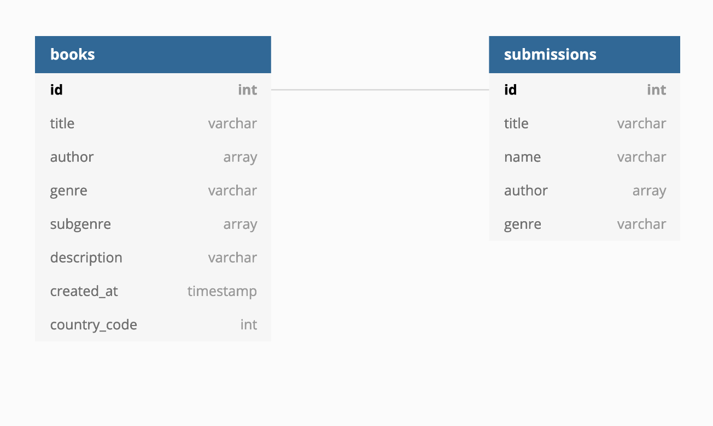
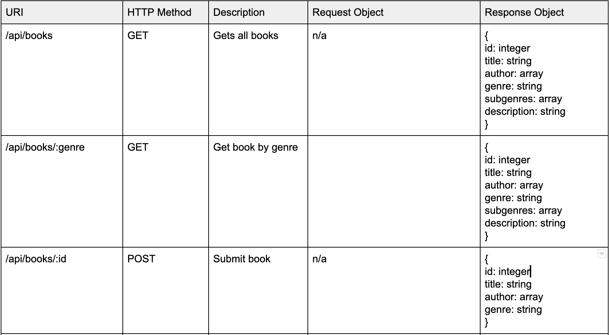

# csproject
Cracked Spines Project is a database written by
marginalized authors of color.

## Project setup
```
yarn install

yarn add vue-router --save-dev

Due to the fact this project uses Vue.js 3.0, you will need to
install a beta version of Vue Devtools in order to utilize it for
production. You can find the newest beta version below.

[Vue-Devtools](https://github.com/vuejs/vue-devtools/releases)
```
## Database Schema
The following is a screenshot of the simple database utilized in
this MVP.



## API Requests
Below is the API documentation for this project.


This is a student project that was created at
[CodeOp](http://codeop.tech), a full stack development bootcamp in Barcelona._